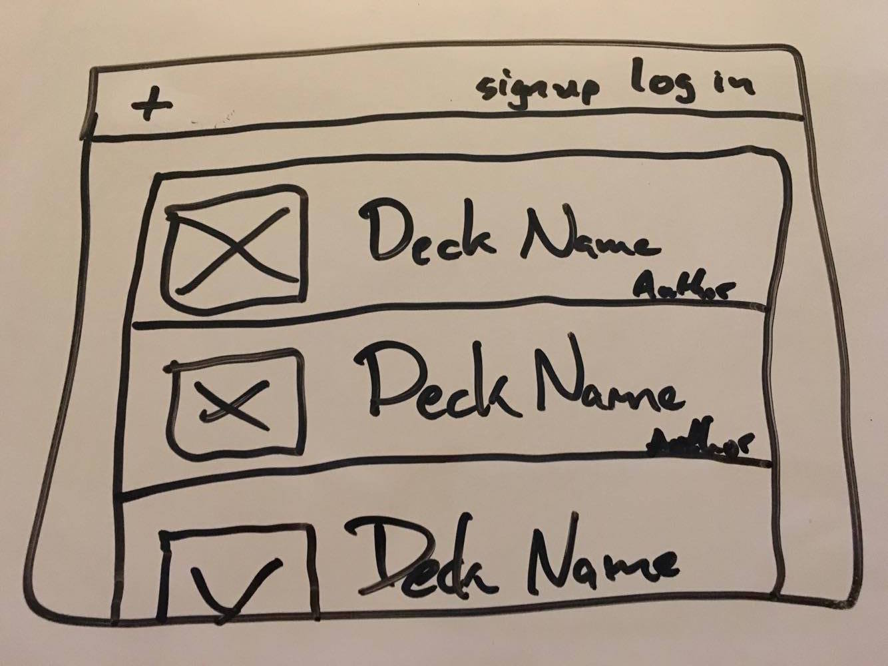

# README
## Description
This is a site dedicated to creating and sharing Magic: The Gathering Decks.  It will *hopefully* show meaningful information that current deck building sites do not make easily accessible 
## ERD 
###### (user and deck relationship should be swapped *oops*)

## Wireframes

## [Trello Link](https://trello.com/b/MRyyjxEc/project-2-mtg-deck-builder)